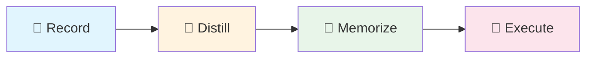

<p align="center">
  
  
  
</p>

<h1 align="center">🧠 Exogram</h1>

<p align="center">
  <strong>Procedural Memory Middleware for Browser Agents</strong><br>
  <em>One demonstration, permanent reuse, cross-UI generalization</em>
</p>

<p align="center">
  <a href="#-quick-start">Quick Start</a> •
  <a href="#-how-it-works">How It Works</a> •
  <a href="#-why-exogram">Why Exogram</a> •
  <a href="#-中文文档">中文文档</a>
</p>

---

## 🎬 Demo

<video src="https://github.com/user-attachments/assets/07af1f77-4344-4916-adfe-984a3626d105" controls width="100%"></video>

> *Recording a complex enterprise backend operation → Distilling cognitive rules → Agent autonomous replay*

---

## ✨ What is Exogram?

**Exogram** is a **"Procedural Memory"** middleware for Browser Agents. Through a closed loop of **"Record → Cognitive Distillation → Rule Injection"**, it solves the fragility of traditional RPA and the uncontrollability of general-purpose Agents.

Think of it this way:
- **browser-use** is the Agent's **"hands"** (execution layer)
- **workflow-use** is the Agent's **"eyes"** (perception layer)  
- **Exogram** is the Agent's **"hippocampus"** (memory layer)

It doesn't store videos — it stores **"experience"** (heuristics). Like a senior accountant teaching an apprentice: *"Even though the system got upgraded, just find that red stamp button and you'll be fine."*

---

## 🎯 Why Exogram?

| Pain Point | Status Quo | Exogram's Solution |
|------------|------------|-------------------|
| **Fragility** | Traditional RPA (Selenium) records coordinates/XPath, breaks on minor UI changes | **Semantic Anchoring:** Remembers "intent" (click the button that means 'Export'), not "position" |
| **High Cost** | Vision-based Agents (Skyvern) screenshot every step, expensive tokens | **Logic Distillation:** Extracts logic from DOM code, runs fast at 1/10 the cost |
| **Hallucination** | General Agents (AutoGPT) easily get lost or make random operations | **Master-Apprentice Mode:** Humans record the "golden path", Agent generalizes within bounds |
| **Privacy** | Cloud Agents require uploading enterprise backend screenshots | **Local-First:** Sensitive data stays local, only DOM structure uploaded |

---

## 🚀 Quick Start

### Installation

```bash
# Create virtual environment
uv venv --seed -p 3.11 .venv
source .venv/bin/activate

# Install Exogram
pip install -e .

# For interactive recording (optional)
pip install -e ".[recorder]"
playwright install chromium
```

### Configuration

```bash
cp .env.example .env
# Edit .env, fill in OPENAI_API_KEY
```

### End-to-End Workflow



**Step 1: Interactive Recording** — Open browser, perform your task

```bash
exogram record-live --topic ERP_Export --start-url "https://your-erp.com"
```

**Step 2: Cognitive Distillation** — LLM analyzes and extracts operational knowledge

```bash
exogram distill --recording data/recordings/ERP_Export.raw_steps.json
```

**Step 3: Execute with Knowledge** — Agent performs task with injected wisdom

```bash
exogram run --topic ERP_Export --task "Download yesterday's sales report in CSV format"
```

---

## 🏗️ How It Works

```
┌─────────────────────────────────────────────────────────────────┐
│                        EXOGRAM PIPELINE                          │
├─────────────────────────────────────────────────────────────────┤
│                                                                  │
│   ┌──────────┐      ┌──────────┐      ┌──────────┐              │
│   │  Record  │ ───▶ │ Distill  │ ───▶ │ Memorize │              │
│   │          │      │          │      │          │              │
│   │ Raw DOM  │      │   LLM    │      │  JSONL   │              │
│   │  Events  │      │ Analysis │      │  Store   │              │
│   └──────────┘      └──────────┘      └──────────┘              │
│        │                                    │                    │
│        │                                    ▼                    │
│        │            ┌──────────────────────────────┐            │
│        │            │     🧠 Cognitive Memory       │            │
│        │            │  • Navigation patterns        │            │
│        │            │  • Form filling tips          │            │
│        │            │  • Exception handling         │            │
│        │            │  • Anti-patterns              │            │
│        │            └──────────────────────────────┘            │
│        │                          │                              │
│        ▼                          ▼                              │
│   ┌──────────┐            ┌──────────────┐                      │
│   │  Agent   │ ◀───────── │ Wisdom Inject │                      │
│   │ Execute  │            │  to Prompt    │                      │
│   └──────────┘            └──────────────┘                      │
│                                                                  │
└─────────────────────────────────────────────────────────────────┘
```

### Key Components

| Module | Description |
|--------|-------------|
| `recording/` | Capture browser operations (via Playwright or workflow-use JSON) |
| `distillation/` | LLM-powered cognitive extraction (SemanticDistiller) |
| `memory/` | JSONL-based long-term memory storage |
| `execution/` | browser-use Agent with knowledge injection |

---

## 📊 Comparison with Alternatives

| Feature | Exogram | Skyvern | LaVague | Selenium |
|---------|---------|---------|---------|----------|
| Learning Mode | Recording + Distillation | Vision API | Code Framework | Script Recording |
| UI Resilience | ⭐⭐⭐⭐⭐ Semantic | ⭐⭐⭐⭐ Visual | ⭐⭐⭐ Code | ⭐ XPath |
| Token Cost | Low (DOM only) | High (screenshots) | Medium | N/A |
| Privacy | Local-first | Cloud | Local | Local |
| Setup Complexity | Low | Medium | High | Low |

---

## 🔧 Advanced Usage

### SSO Login State Persistence

```bash
# First time: save login state
exogram setup-auth --start-url https://sso.your-company.com

# Subsequent recordings automatically reuse login state
exogram record-live --topic MyTask --start-url https://app.your-company.com
```

### Custom Models

Configure different models for distillation and execution in `.env`:

```bash
DISTILLATION_MODEL=gpt-4o      # Smarter model for analysis
EXECUTION_MODEL=gpt-4o-mini    # Faster model for execution
```

### Flash Mode (Speed Priority)

```bash
EXOGRAM_FLASH_MODE=1  # Skip evaluation, use memory only
```

---

## 📝 CLI Reference

```bash
exogram record          # Import workflow-use JSON
exogram record-live     # Interactive browser recording
exogram setup-auth      # Initialize SSO login state
exogram distill         # Cognitive distillation
exogram memorize        # Import cognition to memory
exogram run             # Execute with knowledge
```

---

## 🤝 Contributing

Issues and PRs are welcome! Especially interested in:
- Support for more UI frameworks (Vue, React Admin)
- Multi-language documentation
- Additional memory backends

---

## 📄 License

MIT License - see [LICENSE](LICENSE)

---

<h1 align="center" id="-中文文档">🧠 Exogram 中文文档</h1>

<p align="center">
  <strong>浏览器 Agent 的「程序性记忆」中间件</strong><br>
  <em>一次示教，永久复用，跨 UI 泛化</em>
</p>

---

## ✨ Exogram 是什么？

**Exogram** 是一个为 Browser Agent 设计的**「程序性记忆」**中间件。通过 **「录制 → 认知蒸馏 → 规则注入」** 的闭环，解决传统 RPA 的脆弱性和通用 Agent 的不可控性。

用一个比喻来理解：
- **browser-use** 是 Agent 的 **「手」**（执行层）
- **workflow-use** 是 Agent 的 **「眼」**（感知层）
- **Exogram** 是 Agent 的 **「海马体」**（记忆层）

它不存储视频，它存储的是**「经验」**—— 就像老会计教徒弟：*「虽然系统改版了，但你找那个红色的章盖下去准没错。」*

---

## 🎯 为什么选择 Exogram？

| 痛点 | 现状 | Exogram 的解法 |
|------|------|---------------|
| **脆弱性** | 传统 RPA (Selenium) 记坐标/XPath，UI 微调即崩溃 | **语义锚定：** 记忆的是「意图」（点击那个代表'导出'的按钮），而非「位置」 |
| **高成本** | 视觉流 Agent (Skyvern) 每步截图，Token 极贵且慢 | **逻辑蒸馏：** 基于 DOM 代码提取逻辑，运行极快，成本仅为视觉方案的 1/10 |
| **不可控** | 通用 Agent (AutoGPT) 容易在复杂后台迷路或乱操作 | **师徒模式：** 人类录制「黄金路径」，Agent 在此范围内泛化，杜绝胡乱探索 |
| **隐私** | 云端 Agent 需要上传企业后台截图，存在合规风险 | **本地优先：** 敏感数据本地脱敏，仅上传 DOM 结构提取逻辑，更加合规 |

---

## 🚀 快速开始

### 安装

```bash
# 创建虚拟环境
uv venv --seed -p 3.11 .venv
source .venv/bin/activate

# 安装 Exogram
pip install -e .

# 安装交互式录制功能（可选）
pip install -e ".[recorder]"
playwright install chromium
```

### 配置

```bash
cp .env.example .env
# 编辑 .env，填入 OPENAI_API_KEY
```

### 端到端工作流

**第一步：交互式录制** —— 打开浏览器，完成你的操作

```bash
exogram record-live --topic ERP_Export --start-url "https://your-erp.com"
```

**第二步：认知蒸馏** —— LLM 分析并提取操作知识

```bash
exogram distill --recording data/recordings/ERP_Export.raw_steps.json
```

**第三步：带知识执行** —— Agent 携带「锦囊」执行任务

```bash
exogram run --topic ERP_Export --task "帮我下载昨天的销售报表，CSV 格式"
```

---

## 🏗️ 架构原理

### 核心流程

```
录制阶段        蒸馏阶段         记忆阶段         执行阶段
┌────────┐     ┌────────┐      ┌────────┐      ┌────────┐
│ 人类   │     │  LLM   │      │ JSONL  │      │ Agent  │
│ 操作   │ ──▶ │ 复盘   │ ──▶  │ 存储   │ ──▶  │ 执行   │
│ DOM流  │     │ 提炼   │      │ 检索   │      │ 泛化   │
└────────┘     └────────┘      └────────┘      └────────┘
```

### 认知蒸馏输出示例

```json
{
  "website": {
    "name": "若依管理系统",
    "type": "企业后台管理",
    "description": "基于 Vue + Element UI 的后台框架"
  },
  "operation_flow": [
    {"phase": "导航定位", "description": "从侧边栏找到目标菜单"},
    {"phase": "数据筛选", "description": "设置日期范围和状态过滤"},
    {"phase": "导出操作", "description": "点击导出按钮并等待下载"}
  ],
  "operation_knowledge": {
    "navigation_pattern": "左侧树形菜单 → 二级页面 → 操作按钮",
    "precautions": ["导出大量数据时需等待loading消失", "日期选择器需要点击确认"]
  }
}
```

---

## 🔧 进阶用法

### SSO 登录态复用

```bash
# 首次：保存登录态
exogram setup-auth --start-url https://sso.your-company.com

# 后续录制自动复用登录态
exogram record-live --topic MyTask --start-url https://app.your-company.com
```

### 自定义模型

在 `.env` 中配置不同模块使用不同模型：

```bash
DISTILLATION_MODEL=gpt-4o      # 蒸馏用更聪明的模型
EXECUTION_MODEL=gpt-4o-mini    # 执行用更快的模型
```

### Flash 模式（极速执行）

```bash
EXOGRAM_FLASH_MODE=1  # 跳过评估，直接使用记忆
```

---

## 📁 项目结构

```
exogram/
├── src/exogram/
│   ├── recording/          # 录制模块
│   │   ├── live_recorder.py      # 交互式录制器
│   │   └── workflow_use_adapter.py
│   ├── distillation/       # 认知蒸馏
│   │   └── semantic_distiller.py
│   ├── memory/             # 长期记忆
│   │   └── jsonl_store.py
│   ├── execution/          # 带知识执行
│   │   ├── executor.py
│   │   └── context.py
│   └── cli.py              # 命令行入口
├── data/
│   ├── recordings/         # 录制文件
│   └── memory/             # 记忆库
└── examples/               # 示例文件
```

---

## 📝 命令行参考

| 命令 | 说明 |
|------|------|
| `exogram record` | 导入 workflow-use 的 JSON |
| `exogram record-live` | 交互式浏览器录制 |
| `exogram setup-auth` | 初始化 SSO 登录态 |
| `exogram distill` | 认知蒸馏 |
| `exogram memorize` | 导入认知到记忆库 |
| `exogram run` | 带知识执行任务 |

---

## 🤝 参与贡献

欢迎提交 Issue 和 PR！特别期待：
- 更多 UI 框架适配（Vue Admin、React Admin）
- 多语言文档
- 更多记忆后端支持

---

## 📄 开源协议

MIT License - 详见 [LICENSE](LICENSE)

---

<p align="center">
  <strong>Exogram — 让每一次操作都成为 Agent 的经验</strong>
</p>
